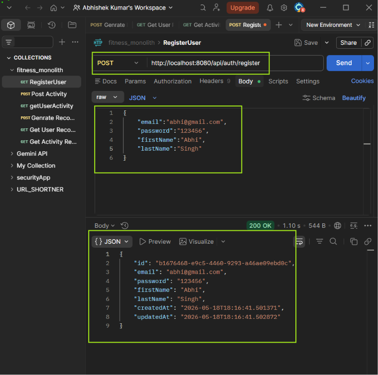
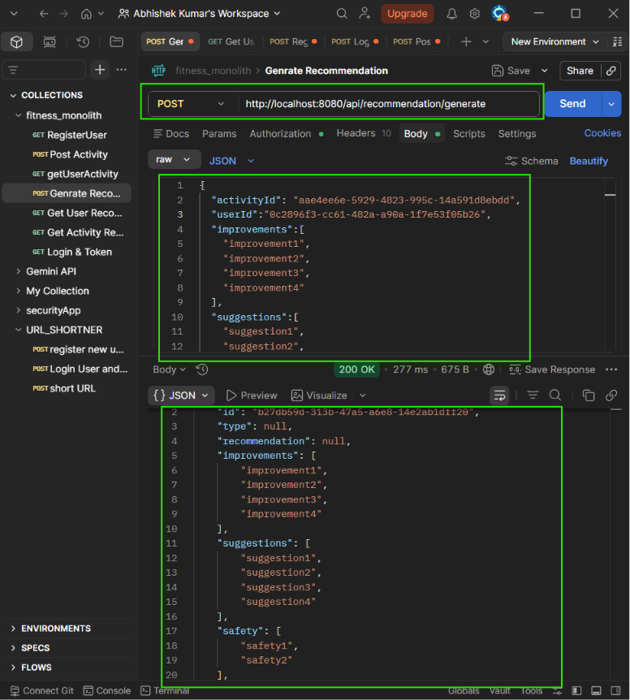
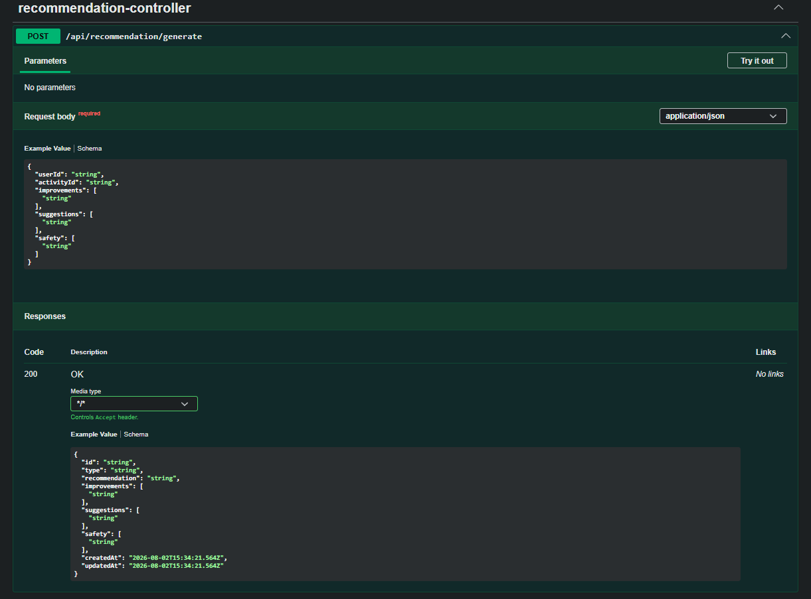

# Fitness Monolith Backend


`fitness-monolith` is a Docker-ready Spring Boot REST API for a fitness tracking backend. It handles user registration, login, JWT-based authentication, activity tracking, and recommendation management using a layered monolithic architecture.

The backend is designed as a single deployable service with clean separation between controllers, services, repositories, DTOs, entities, security, and exception handling.

---

## Project Snapshot

| Area | Details |
|---|---|
| Application type | Monolithic REST API |
| Language | Java 25 |
| Framework | Spring Boot 4.1 |
| Security | Spring Security + JWT |
| Database | MySQL |
| Persistence | Spring Data JPA / Hibernate |
| API docs | Swagger UI / OpenAPI |
| Packaging | Maven |
| Containerization | Docker |

---

## Visual Architecture

```text
Client / Postman / Swagger UI
        |
        | HTTP request
        | Authorization: Bearer <jwt>
        v
+-------------------------------+
| Spring Security Filter Chain  |
+-------------------------------+
        |
        v
+-------------------------------+
| JwtAuthenticationFilter       |
| - reads Authorization header  |
| - validates JWT               |
| - sets authenticated user     |
+-------------------------------+
        |
        v
+-------------------------------+
| Controller Layer              |
| - receives REST requests      |
| - validates DTO payloads      |
+-------------------------------+
        |
        v
+-------------------------------+
| Service Layer                 |
| - business logic              |
| - ownership checks            |
| - DTO/entity mapping          |
+-------------------------------+
        |
        v
+-------------------------------+
| Repository Layer              |
| - Spring Data JPA             |
| - database queries            |
+-------------------------------+
        |
        v
+-------------------------------+
| MySQL Database                |
| - users                       |
| - activities                  |
| - recommendations             |
+-------------------------------+
```

---

## Features

- User registration and login
- BCrypt password hashing
- JWT token generation and validation
- Authenticated activity tracking
- Authenticated user activity lookup
- Recommendation generation for user activities
- DTO validation using Bean Validation
- Global exception handling with structured JSON errors
- MySQL persistence with Spring Data JPA
- Swagger UI for API exploration
- Docker image support with environment-based runtime configuration

---

## Layered Structure

```text
src/main/java/com/project/fitness_monolith
|
|-- controller      REST API endpoints
|-- dto             Request and response payloads
|-- exception       Global API error handling
|-- model           JPA entities and enums
|-- repository      Spring Data JPA repositories
|-- security        JWT and Spring Security configuration
`-- service         Business logic
```

<details>
<summary>Layer responsibilities</summary>

| Layer | Responsibility |
|---|---|
| Controller | Accepts HTTP requests and returns HTTP responses |
| DTO | Defines API request and response shapes |
| Service | Contains business rules and application logic |
| Repository | Handles database access through Spring Data JPA |
| Model | Maps Java objects to database tables |
| Security | Handles authentication, JWT parsing, roles, and protected routes |
| Exception | Converts validation and business errors into clean JSON responses |

</details>

---

## API Endpoints

Base URL:

```text
http://localhost:8080
```

| Method | Endpoint | Auth | Description |
|---|---|---|---|
| POST | `/api/auth/register` | Public | Register a new user |
| POST | `/api/auth/login` | Public | Login and receive JWT token |
| POST | `/api/activities` | Required | Track an activity for authenticated user |
| GET | `/api/activities` | Required | Get activities for authenticated user |
| POST | `/api/recommendation/generate` | Required | Generate recommendation for an activity |
| GET | `/api/recommendation/user` | Required | Get recommendations for authenticated user |
| GET | `/api/recommendation/activity/{activityId}` | Required | Get recommendations by activity ID |

Swagger UI:

```text
http://localhost:8080/swagger-ui/index.html
```

OpenAPI JSON:

```text
http://localhost:8080/v3/api-docs
```

---

## Authentication Flow

```text
1. Register user
        |
        v
2. Login with email and password
        |
        v
3. Receive JWT token
        |
        v
4. Send token in protected API requests
        |
        v
5. Backend identifies user from token
```

Protected request header:

```text
Authorization: Bearer <your-jwt-token>
```

Important security behavior:

- Activity APIs do not trust `userId` from request headers.
- The authenticated user ID is taken from the JWT token.
- Recommendation generation checks that the activity belongs to the authenticated user.

---

## Environment Variables

The application reads database configuration from environment variables.

| Variable | Required | Example |
|---|---|---|
| `DB_URL` | Yes | `jdbc:mysql://localhost:3306/fitness_db` |
| `DB_USERNAME` | Yes | `root` |
| `DB_PASSWORD` | Yes | `your_mysql_password` |

For Docker on Windows/Mac, if MySQL is running on your host machine:

```text
DB_URL=jdbc:mysql://host.docker.internal:3306/fitness_db
```

---

## Run Locally

Set environment variables first.

PowerShell:

```powershell
$env:DB_URL="jdbc:mysql://localhost:3306/fitness_db"
$env:DB_USERNAME="root"
$env:DB_PASSWORD="your_mysql_password"
.\mvnw.cmd spring-boot:run
```

Bash:

```bash
export DB_URL="jdbc:mysql://localhost:3306/fitness_db"
export DB_USERNAME="root"
export DB_PASSWORD="your_mysql_password"
./mvnw spring-boot:run
```

Run tests:

```bash
./mvnw test
```

Windows:

```powershell
.\mvnw.cmd test
```

---

## Docker Usage

### Pull From Docker Hub

```bash
docker pull abhishekbgp/fitness-monolith:latest
```

### Run Docker Hub Image

If MySQL is running on your host machine:

```bash
docker run --name fitness-monolith-api \
  -p 8080:8080 \
  -e DB_URL=jdbc:mysql://host.docker.internal:3306/fitness_db \
  -e DB_USERNAME=root \
  -e DB_PASSWORD=your_mysql_password \
  abhishekbgp/fitness-monolith:latest
```

PowerShell single-line version:

```powershell
docker run --name fitness-monolith-api -p 8080:8080 -e DB_URL=jdbc:mysql://host.docker.internal:3306/fitness_db -e DB_USERNAME=root -e DB_PASSWORD=your_mysql_password abhishekbgp/fitness-monolith:latest
```

Stop and remove container:

```bash
docker stop fitness-monolith-api
docker rm fitness-monolith-api
```

### Build Image With Spring Boot Buildpacks

```bash
./mvnw spring-boot:build-image
```

Windows:

```powershell
.\mvnw.cmd spring-boot:build-image
```

This creates a local Docker image:

```text
fitness-monolith:0.0.1-SNAPSHOT
```

Run that local image:

```bash
docker run --name fitness-monolith-api \
  -p 8080:8080 \
  -e DB_URL=jdbc:mysql://host.docker.internal:3306/fitness_db \
  -e DB_USERNAME=root \
  -e DB_PASSWORD=your_mysql_password \
  fitness-monolith:0.0.1-SNAPSHOT
```

### Build Image With Dockerfile

Package the jar:

```bash
./mvnw package
```

Build image:

```bash
docker build -t fitness-monolith .
```

Run image:

```bash
docker run --name fitness-monolith-api \
  -p 8080:8080 \
  -e DB_URL=jdbc:mysql://host.docker.internal:3306/fitness_db \
  -e DB_USERNAME=root \
  -e DB_PASSWORD=your_mysql_password \
  fitness-monolith
```

---

## Docker Runtime View

```text
Host Machine
|
|-- MySQL running on localhost:3306
|
`-- Docker
    |
    `-- fitness-monolith-api container
        |
        | DB_URL=jdbc:mysql://host.docker.internal:3306/fitness_db
        v
    Connects back to host MySQL
```

When MySQL is also containerized later with Docker Compose, the database host will become the Compose service name, for example:

```text
jdbc:mysql://mysql:3306/fitness_db
```

---

## Example API Payloads

<details>
<summary>Register user</summary>

```http
POST /api/auth/register
Content-Type: application/json
```

```json
{
  "email": "user@example.com",
  "password": "secret123",
  "firstName": "Test",
  "lastName": "User"
}
```

</details>

<details>
<summary>Login user</summary>

```http
POST /api/auth/login
Content-Type: application/json
```

```json
{
  "email": "user@example.com",
  "password": "secret123"
}
```

Response contains:

```json
{
  "token": "jwt-token",
  "user": {
    "id": "user-id",
    "email": "user@example.com"
  }
}
```

</details>

<details>
<summary>Track activity</summary>

```http
POST /api/activities
Authorization: Bearer <token>
Content-Type: application/json
```

```json
{
  "type": "RUNNING",
  "duration": 30,
  "caloriesBurned": 250,
  "startTime": "2026-08-03T10:30:00",
  "additionalMatrix": {
    "distanceKm": 5,
    "averagePace": "6:00"
  }
}
```

</details>

<details>
<summary>Generate recommendation</summary>

```http
POST /api/recommendation/generate
Authorization: Bearer <token>
Content-Type: application/json
```

```json
{
  "activityId": "activity-id",
  "improvements": [
    "Increase warm-up duration"
  ],
  "suggestions": [
    "Maintain steady pace for the first 10 minutes"
  ],
  "safety": [
    "Stay hydrated"
  ]
}
```

</details>

---

## Screenshots

Example API and Swagger outputs are available in the [`PostMan_Output`](PostMan_Output) folder.

| Register | Login | Activity |
|---|---|---|
|  |  |  |

| Recommendation | Swagger |
|---|---|
|  |  |

---

## Useful Commands

```bash
# Run tests
./mvnw test

# Start app locally
./mvnw spring-boot:run

# Build jar
./mvnw package

# Build Docker image through Spring Boot Buildpacks
./mvnw spring-boot:build-image

# List local Docker image
docker images fitness-monolith
```

---

## Current Status

Implemented:

- Spring Boot REST backend
- JWT authentication
- DTO validation
- Global error handling
- MySQL persistence
- Swagger UI
- Docker image support

Planned improvements:

- Docker Compose for backend + MySQL
- Rule-based or AI-powered recommendation engine
- More integration tests
- Production profile configuration

---

## Author

Built and maintained by **Abhishek Kumar**.

<table>
  <tr>
    <td><strong>Project</strong></td>
    <td><code>fitness-monolith</code></td>
  </tr>
  <tr>
    <td><strong>Role</strong></td>
    <td>Java Backend Developer</td>
  </tr>
  <tr>
    <td><strong>Focus</strong></td>
    <td>Spring Boot, REST APIs, JWT Security, MySQL, Docker</td>
  </tr>
  <tr>
    <td><strong>Docker Hub</strong></td>
    <td><a href="https://hub.docker.com/r/abhishekbgp/fitness-monolith">abhishekbgp/fitness-monolith</a></td>
  </tr>
  <tr>
    <td><strong>GitHub</strong></td>
    <td><a href="https://github.com/Abhishekkumar071">profile link here</a></td>
  </tr>
</table>

If this project helped you understand Spring Boot backend development, JWT security, or Dockerized deployment, consider starring the repository.
